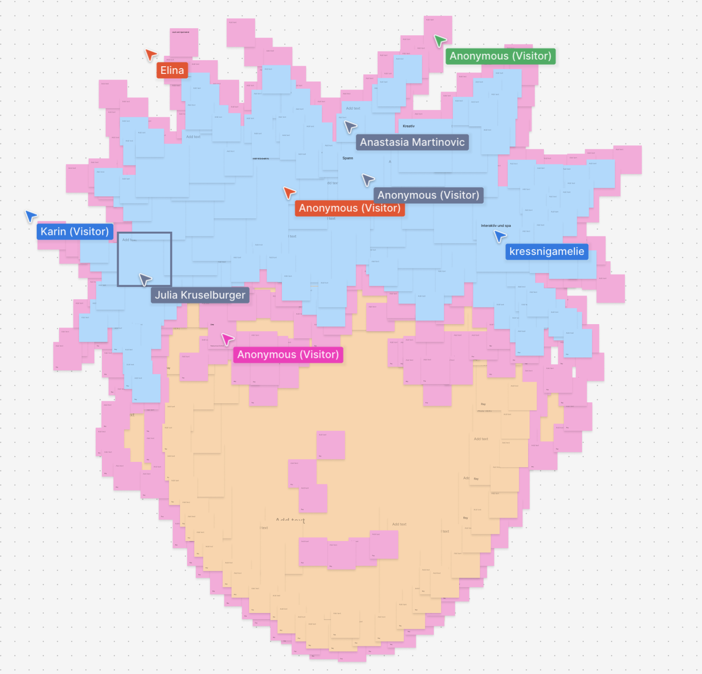

<p align="center">
  
</p>

# Rebell\*innen Kalender

The Rebell\*innen Kalender is developed together with [Verein Amazone](https://www.amazone.or.at/),
workshop participants and [Independo](https://independo.app/) as a digital version of the existing
[Rebell\*innen Kalender](https://www.amazone.or.at/projekte/rebell-innen-kalender).

This repository is the central place for planning, discussion and development of the first version.

## Status

Early development. The technical foundation (Angular 22 + Capacitor 8, tooling, the application
architecture skeleton and the design system) is in place, as is the SQLite foundation with its first
table: the „Nicht vergessen“ list on the Today page. The remaining product screens are tracked in the
milestones below.

## What is it about?

The first version is meant to be a simple, everyday calendar app that works **without login and
without its own server infrastructure**. The initial focus is on:

- A today view / start screen
- Personal appointments and basic calendar features
- Curated content from the Rebell\*innen / Amazone context
- A simple checklist
- Customization and accessibility
- Sharing individual appointments or content through existing channels

Some ideas from the workshops remain important but are likely later expansion paths, for example
friend lists, real shared calendars, chat, automatic location search, or automatic news feeds.

## Supported products

iOS and Android only. There is deliberately **no** browser/PWA release target, no SSR, no Angular
service worker, and no backend or cloud synchronization.

| Property           | Value                               |
| ------------------ | ----------------------------------- |
| App ID (bundle ID) | `at.or.amazone.rebellinnenkalender` |
| Display name       | `Rebell*innen Kalender`             |
| Minimum iOS        | 16.4                                |
| Minimum Android    | API 24 (Android 7.0)                |

## Architecture

The application follows a layered architecture with the dependency direction
**View/Presenters → Interactors → Data**. Before changing application code, read:

- [Frontend architecture](./docs/architecture/frontend-architecture.md)
- [Data & persistence](./docs/architecture/data-persistence.md)
- [Agent instructions](./AGENTS.md)

## Tech stack

- [Angular](https://angular.dev) 22 — standalone, zoneless, strict, signals-first
- [Capacitor](https://capacitorjs.com) 8 — native iOS and Android
- [Tailwind CSS](https://tailwindcss.com) 4
- Angular CDK, Angular Aria, [Lucide](https://lucide.dev) icons
- [`@capacitor-community/sqlite`](https://github.com/capacitor-community/sqlite) for local persistence
- [`@ebarooni/capacitor-calendar`](https://github.com/ebarooni/capacitor-calendar) for the device calendar
- Vitest (unit) + Playwright and Axe (e2e / accessibility)
- ESLint (flat config) + Prettier

## Development

### Prerequisites

- **Node.js 24+** (pinned in `.nvmrc` / `.node-version` to 24.18.0)
- **pnpm 11+** (exact version pinned via the `packageManager` field in `package.json`)
- For native builds: **Xcode** (iOS) and **Android Studio / JDK** (Android)

pnpm is the only supported package manager. Enable [Corepack](https://nodejs.org/api/corepack.html)
so the pinned pnpm version is used automatically:

```bash
corepack enable
```

### Install

```bash
pnpm install
```

### Angular development server

```bash
pnpm start        # http://localhost:4200
```

### Tests, linting and formatting

```bash
pnpm test         # Unit tests (Vitest, watch mode)
pnpm test:ci      # Unit tests once (non-interactive)
pnpm lint         # Angular ESLint (includes architecture layer-boundary rules)
pnpm format       # Apply Prettier
pnpm format:check # Check formatting
pnpm e2e          # Playwright smoke test incl. Axe accessibility scan
```

### Build and Capacitor synchronization

```bash
pnpm build        # Production build to dist/rebellinnen-kalender/browser
pnpm cap:sync     # Build + sync both native projects
```

### Open the native projects

```bash
pnpm cap:open:ios      # Opens the iOS project in Xcode
pnpm cap:open:android  # Opens the Android project in Android Studio
```

### Angular CLI MCP

For version-accurate Angular support, the official
[Angular CLI MCP Server](https://angular.dev/ai/mcp) can be used. It runs project-locally through
the installed Angular CLI:

```bash
pnpm exec ng mcp
```

Setup is host/editor-side and deliberately **not** committed to the repository.

## Planning

Planning happens through GitHub Issues and Milestones. The early issues are meant as discussion and
decision spaces where variants, wireframes, questions and feedback are collected.

[Current milestones](https://github.com/verein-amazone/rebellinnen-kalender/milestones):

1. V1 product picture & wireframes
2. MVP base: local calendar app
3. Curated content & organization events
4. Sharing & shared use
5. Test version, release & open-source foundation

### Good entry points

- #4 Define V1 scope and app structure
- #5 Design the start screen / today view & navigation
- #6 Design the calendar & personal appointments
- #7 Design the checklist & important things of the day
- #8 Design customization & accessibility

Workshop ideas already visible in the repo:

- #1 Positive / curated content of the day
- #2 Show events and appointments from organizations
- #3 Share appointments with others

### How to give feedback

Feedback is welcome directly in the GitHub Issues. Workshop participants may also give feedback via
the WhatsApp group; the project team transfers relevant feedback into the matching issue so that
decisions stay traceable. See [CONTRIBUTING.md](./CONTRIBUTING.md) for details.

## Note on design

The visual design (colors, typography, components) will be derived later from the approved Figma
mockup.

The app has a small in-app design system in the meantime: design tokens and visual patterns as CSS
in `src/styles/`, and the few UI primitives that carry real behaviour as Angular components in
`src/app/view/components/`. It is deliberately minimal and grows only when a second call site
appears. See [docs/architecture/design-system.md](./docs/architecture/design-system.md).
