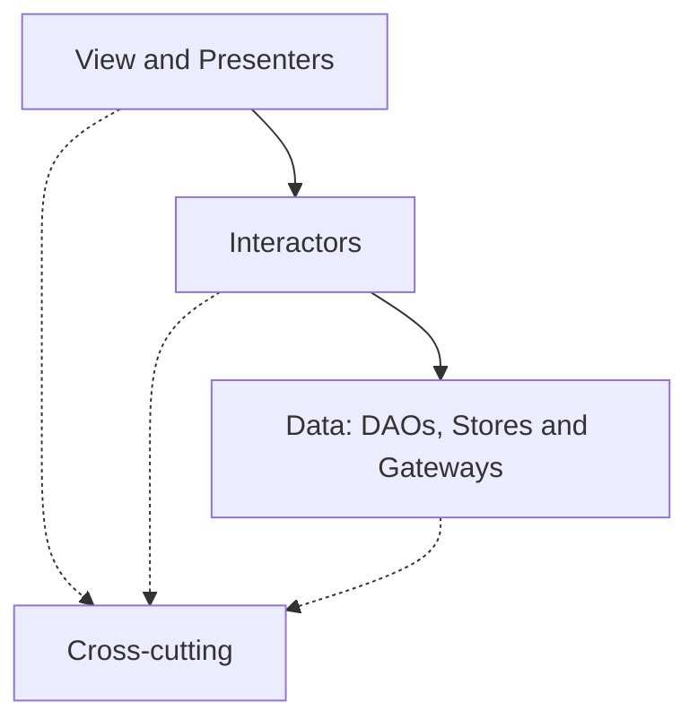

# Frontend architecture

This document describes how the Angular application is structured and the rules that keep it
maintainable. It applies to all application code under `src/app/`.

## Layers

The application has three primary layers plus one supporting area:

1. **View / Presenters** (`view/`) — everything the user sees and interacts with.
2. **Interactors** (`interactors/`) — application use cases and business rules.
3. **Data** (`data/`) — persistence and external data-source access.
4. **Cross-cutting** (`cross-cutting/`) — shared technical utilities and UI/device infrastructure.

## Dependency direction

The primary flow is **View/Presenters → Interactors → Data**. Cross-cutting code may be consumed
where appropriate, but it must never be used to hide a violation of that direction.



Cross-cutting dependencies (dotted) are permitted only when they do not violate the primary layer
boundaries. The rules below are enforced in `eslint.config.js` via `no-restricted-imports` on the
`@app/*` alias:

- `view/**` must not import from `data/**`.
- `data/**` must not import from `view/**` or `interactors/**`.
- `interactors/**` must not import from `view/**`.

## View layer (`view/`)

All Angular UI artifacts live here.

### Pages (`view/pages/`)

Route-level components that act as **presenters**. Page folders mirror the route structure.

Pages **may**: hold view-facing signals, represent loading/error state, call interactors, react to
user actions, open dialogs, show UI feedback, initiate navigation, and use contexts and UI/device
infrastructure.

Pages **must not**: inject DAOs, execute SQL, access the SQLite plugin, access native calendar APIs
directly, or contain substantial business rules.

Naming:

```
view/pages/today-page/
  today.page.ts
  today.page.html
  today.page.css
```

### Dialogs (`view/dialogs/`)

Modal interaction flows. Their presenters follow the same rules as pages.

```
view/dialogs/confirmation/
  confirmation.dialog.ts
  confirmation.dialog.html
  confirmation.dialog.css
```

### Scaffolds (`view/scaffolds/`)

Page-level layout and navigation structure. Simple layout/navigation glue only — no business logic
or data access.

```
view/scaffolds/main-navigation/
  main-navigation.scaffold.ts
  main-navigation.scaffold.html
  main-navigation.scaffold.css
```

### Blocks (`view/blocks/`)

Reusable feature-level compositions of UI elements. Create a block only when the same composition is
used in the same way in more than one page, scaffold or dialog. Blocks use signal inputs/outputs and
remain free of data access.

```
view/blocks/content-preview/
  content-preview.block.ts
  content-preview.block.html
  content-preview.block.css
```

### Components (`view/components/`)

Small internal UI primitives (buttons, icon buttons, cards, form controls, loading indicators). They
behave like native HTML elements: clear signal inputs/outputs, no feature-specific business logic, no
interactor or DAO injection, accessible native HTML semantics by default. Use Angular CDK and Angular
Aria where they add accessible behavior, and Lucide for icons.

## Interactors (`interactors/`)

Stateless Angular services representing application use cases. Group them by domain, not by page —
for example `interactors/daily-content/`, `interactors/saved-content/`, `interactors/calendar/`,
`interactors/settings/` (examples, not required folders).

Rules:

- Each public method represents a use case.
- Interactors orchestrate one or more data-layer dependencies and contain business rules and
  transformations.
- Interactors may return use-case-specific view models (`*.vm.ts`, close to their domain).
- Interactors **must not** contain view state, navigate, open dialogs, show toasts, or inject Angular
  components / UI contexts. Pass contextual values as method parameters.

A separate view model is not required for every record — use a `*.vm.ts` type only when the shape
exposed by an interactor meaningfully differs from the persisted record or combines multiple sources.
Persisted records must not be imported directly into templates when that exposes persistence details.

## Data layer (`data/`)

Owns persistence and external data-source access. See
[data-persistence.md](./data-persistence.md) for the full detail. In short:

- `data/entities/` — persisted record types (`*.record.ts`).
- `data/daos/` — thin, table-oriented SQLite access (`*.dao.ts`), no business rules.
- `data/migrations/` — versioned schema changes.
- `data/stores/` — small persisted values that do not belong in relational tables.
- `data/gateways/` — wrappers around external data sources (e.g. the native calendar). Plugin types
  stay inside the gateway.

Repositories (`*Repository`) are **not** introduced automatically; reserve them for a meaningful
abstraction that combines or selects between multiple data sources.

## Cross-cutting layer (`cross-cutting/`)

Only create cross-cutting code when it is actually shared.

- `infrastructure/` — stateless wrappers around technical UI/device capabilities (navigation helpers,
  opening system settings, sharing, UI messages, other device APIs initiated by presenters). The
  native calendar is an intentional exception: because it is a queryable data source, its wrapper
  lives in `data/gateways/`, not here.
- `contexts/` — readonly, application-wide state exposed to components via signals. Contexts may be
  injected only into components/presenters; interactors and data-layer classes must not inject them.
  Prefer local component state for page-specific concerns.
- `helpers/`, `pipes/`, `directives/`, `validators/` — reusable technical utilities. They must not
  conceal data-layer access or upward dependencies.
- `markdown/` — the internal Markdown renderer that wraps the `marked` library. See
  [Markdown rendering](#markdown-rendering).

## Markdown rendering

Curated content may be authored in Markdown. Rendering is intentionally small and safe.

- **`cross-cutting/markdown/markdown-renderer.ts`** (`MarkdownRenderer`) is the only place the
  `marked` library is used. `marked` converts the Markdown to HTML, and then
  [DOMPurify](https://github.com/cure53/DOMPurify) reduces that HTML to a strict allow-list. We never
  build HTML strings or escape by hand.
- **`view/components/markdown-content/markdown-content.ts`** (`MarkdownContentComponent`) is the
  reusable primitive. It takes a required `markdown` signal input and binds the rendered string with
  `[innerHTML]`, so Angular's sanitizer runs as a second layer. It never uses
  `bypassSecurityTrustHtml` and never manipulates the DOM directly.

### Why `marked` directly, and no Angular wrapper

We use the original `marked` package instead of an Angular wrapper such as `ngx-markdown`. The
integration we need is tiny (one renderer plus one component), and wrapping `marked` ourselves keeps
full control over the allowed Markdown subset and the sanitization pipeline. `marked`'s types and
APIs stay inside `MarkdownRenderer` and must not leak into components or feature code.

### Why DOMPurify for sanitization

Sanitization is delegated to DOMPurify — a widely used, audited HTML sanitizer — rather than to
hand-written escaping or ad-hoc URL checks, which are error-prone. DOMPurify expresses the allowed
subset declaratively (`ALLOWED_TAGS`, `ALLOWED_ATTR`, `ALLOWED_URI_REGEXP`), so the restriction lives
in data, not in bespoke string manipulation. Angular's own sanitizer still runs at the `[innerHTML]`
binding as a second, independent layer.

### Supported Markdown subset

Allowed and rendered as semantic HTML: paragraphs, emphasis (`em`) and strong emphasis (`strong`),
ordered and unordered lists, block quotes, links, and **level-two and level-three headings only**.

Rejected: raw/embedded HTML, images, tables, code blocks and inline code, and any other element
outside the allow-list. Their disallowed tags are stripped while their text content is kept, so
level-one and level-four-plus headings, for example, survive as plain text rather than headings.

### Sanitization and URL safety

- The rendered HTML always passes through DOMPurify's allow-list in the renderer, and again through
  Angular's `[innerHTML]` binding in the component. `bypassSecurityTrustHtml` is never used.
- Links keep their `href` only for the allow-listed schemes `https:` and `http:` (relative and
  anchor links, which have no scheme, are also allowed), enforced via DOMPurify's
  `ALLOWED_URI_REGEXP`. Any other scheme — for example `javascript:`, `data:` or `mailto:` — has its
  `href` removed, leaving only the link text.

### Rule for feature code

Feature code (pages, blocks, interactors, etc.) must render Markdown through
`MarkdownContentComponent`, or through `MarkdownRenderer` when it only needs the string. **Never
import `marked` outside `cross-cutting/markdown/`.**

## Allowed / forbidden examples

Allowed:

- A page injects a `CalendarInteractor` and renders its returned view model.
- An interactor injects a `ContentItemDao` and a `NativeCalendarGateway`.
- A page uses an `infrastructure/` sharing helper.

Forbidden:

- A page imports `@app/data/daos/content-item.dao` (view → data).
- An interactor imports `@app/view/pages/today-page/...` (interactor → view).
- A DAO imports an interactor or a page (data → interactors/view).
- A Capacitor plugin type appears in an interactor or template instead of behind a gateway.
- Feature code imports `marked` directly instead of using `MarkdownRenderer` /
  `MarkdownContentComponent`.

## Why this architecture

The app is small but is expected to grow (curated content, calendar integration, sharing, later
sync). A clear presenter/use-case/data separation keeps views declarative, keeps business rules
testable in isolation, and keeps persistence and plugin details replaceable behind stable
boundaries.

### Relationship to the Independo mobile architecture

The layered separation (presenters → interactors → data), the DAO/gateway split, and keeping plugin
types behind gateways are inspired by Independo's mobile architecture. It was **intentionally
simplified** for this app: no repositories by default, no ORM, no synchronization infrastructure
(outboxes/tombstones), and no feature-specific contexts as generic state containers. Complexity is
added only when a concrete need appears.
