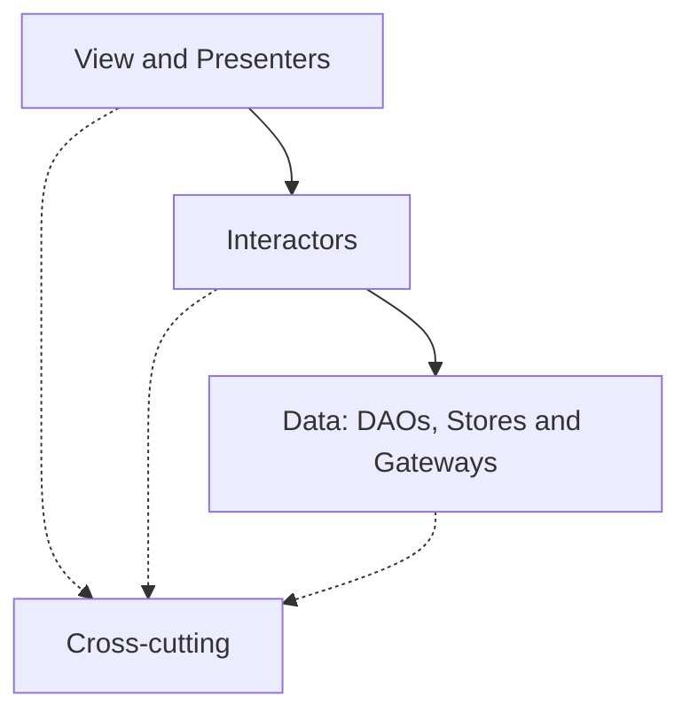

# Frontend architecture

This document describes how the Angular application is structured and the rules that keep it
maintainable. It applies to all application code under `src/app/`.

For the visual primitives see [Design system](./design-system.md); for the WCAG 2.2 AA rules every
view has to satisfy see [Accessibility](./accessibility.md).

## Layers

The application has three primary layers plus one supporting area:

1. **View / Presenters** (`view/`) — everything the user sees and interacts with.
2. **Interactors** (`interactors/`) — application use cases and business rules.
3. **Data** (`data/`) — persistence and external data-source access.
4. **Cross-cutting** (`cross-cutting/`) — shared technical utilities and UI/device infrastructure.

## Dependency direction

The primary flow is **View/Presenters → Interactors → Data**. Cross-cutting code may be consumed
where appropriate, but it must never be used to hide a violation of that direction.



Cross-cutting dependencies (dotted) are permitted only when they do not violate the primary layer
boundaries. The rules below are enforced in `eslint.config.js` via `no-restricted-imports` on the
`@app/*` alias:

- `view/**` must not import from `data/**`.
- `data/**` must not import from `view/**` or `interactors/**`.
- `interactors/**` must not import from `view/**`.

## View layer (`view/`)

All Angular UI artifacts live here.

### Pages (`view/pages/`)

Route-level components that act as **presenters**. Page folders mirror the route structure.

Pages **may**: hold view-facing signals, represent loading/error state, call interactors, react to
user actions, open dialogs, show UI feedback, initiate navigation, and use contexts and UI/device
infrastructure.

Pages **must not**: inject DAOs, execute SQL, access the SQLite plugin, access native calendar APIs
directly, or contain substantial business rules.

Pages are organised in **route groups**. A group owns one area of the app, declares its own routes
next to its pages, and is lazy-loaded from `app.routes.ts` via `loadChildren`. This keeps a growing
route tree readable and keeps each area's routing decisions local to it.

```
view/pages/calendar/
  calendar.routes.ts          exports CALENDAR_ROUTES
  overview/
    overview.page.ts
    overview.page.html
  new-event/
    new-event.page.ts
    new-event.page.html
```

Add a `.page.css` file only when a page actually needs styles that Tailwind utilities cannot
express; do not create empty ones. A visual pattern that more than one screen uses is not a page
style — it belongs in `src/styles/components/` as an `rk-*` class. See
[Design system](./design-system.md).

Because several groups have an `overview` page, class names and selectors are qualified by their
group (`CalendarOverviewPage` / `app-calendar-overview`) while file and folder names stay short.

#### Primary destinations and focused screens

A route declares `data: { tab: 'today' | 'calendar' | 'content' }` when it is one of the three
primary destinations. Every other route is a **focused screen** — a detail, creation or settings
screen that owns the whole viewport.

`MainNavigationScaffold` reads the deepest activated route's `data.tab` and uses it for both
decisions it has to make: which destination is marked active, and whether the bottom navigation is
rendered at all. Adding a focused screen therefore requires nothing beyond leaving `tab` off its
route.

Focused screens use `FocusedScreenScaffold`, which provides the shared header and a single dismiss
action. Its `dismissal` input picks the semantics: `back` (an arrow — the user returns the way they
came) for details and settings subpages, `close` (a cross) for creation and editing screens, where a
back arrow would suggest that entered data is kept.

**Dismissing navigates to an explicit target and replaces the current history entry.** The target is
`returnTo` when the caller passed one, `fallbackLink` otherwise, so every focused screen declares
where leaving it lands. The scaffold deliberately does not call `Location.back()`: a history walk
combined with a pushed dismiss navigation makes the two screens point at each other, and the user
alternates between them forever. Replacing instead of pushing also keeps the history from growing,
so the platform back gesture leaves a screen rather than re-entering the one just left. The same
applies to a page navigating away after finishing its own task (saving an appointment, deleting
one) — those use `replaceUrl: true` for the same reason.

A screen reachable from several places carries its origin in a `?returnTo=` query param rather than
reading it back out of the history; the content detail screen is the example.

#### Page state and navigation

**State that must survive navigation goes in the URL** — as a route parameter or a query parameter,
never in a component field that a re-created page would lose. The selected calendar day, an active
filter or a chosen view mode are route state, not component state.

This keeps the back button, deep links and app restarts correct for free, and it means the app does
not need a custom `RouteReuseStrategy`. Pages read such values through `withComponentInputBinding()`,
which binds route parameters to signal inputs.

#### Focus and announcements

`cross-cutting/infrastructure/page-focus.ts` handles this centrally; individual pages do not manage
focus. Every screen renders exactly one `<h1>` inside the shell's `<main>` landmark, which is what it
targets.

- Opening or closing a focused screen, and the initial load, **move focus** to the new screen's
  title: the context has changed completely.
- Switching between primary destinations only **announces** the new page through the CDK
  `LiveAnnouncer`. Moving focus there would throw a keyboard user out of the bottom navigation they
  are operating.

Component-level announcements follow different rules — see
[Announcements](./accessibility.md#announcements). The one thing not to do is announce the same
event through both a template live region and the `LiveAnnouncer`.

#### Safe areas

The app draws edge to edge: `index.html` sets `viewport-fit=cover`, which is also what makes
`env(safe-area-inset-*)` return real values on iOS — without it they are all `0px` and every inset
silently does nothing.

Use the `.safe-top` / `.safe-bottom` / `.safe-x` utilities from `src/styles/base.css`. Put them on
the element that carries the background, not on the one that carries the layout padding, for two
reasons: the background then extends into the inset while the content stays clear of it, and the
utility does not compete with a `p*-` utility for the same property (both live in Tailwind's
utilities layer, where source order rather than specificity decides).

Who applies what:

- The bottom navigation applies its own bottom inset, so its background fills the home indicator
  area.
- Focused screens apply the top inset to their sticky header.
- For primary destinations, which have no header, the shell applies the top inset to `<main>`.

#### Page transitions

Provided by the router's `withViewTransitions()`. The animation is a short cross-fade defined in
`src/styles/base.css` — the screens are unrelated, so a directional slide would imply a spatial
relationship that does not exist. View transition pseudo-elements sit outside the document tree, so
the reduced-motion rules have to disable them explicitly; see the same file.

**The feature is not registered on iOS.** WKWebView repaints the whole page while snapshotting it,
which shows up as a brief dim or flicker instead of an animation. Skipping only the animation via
`onViewTransitionCreated` does not help, because the snapshot is what causes the artefact — so
`app.config.ts` leaves the feature out entirely there, using `supportsViewTransitions()` from
`cross-cutting/infrastructure/device-platform.ts`, and navigation cuts straight to the new screen.

### Angular CDK stylesheets

CDK behaviour that needs CSS does not bring it along. `@angular/cdk/a11y-prebuilt.css` is imported
in `src/styles.css` because it defines `.cdk-visually-hidden`, which the `LiveAnnouncer` puts on its
element — without it the announcements are rendered as visible page content.
`@angular/cdk/overlay-prebuilt.css` is imported for the same reason: it positions and stacks the
overlay container that sheets render into, and without it a sheet renders as ordinary content at the
end of `<body>`. Import the matching prebuilt stylesheet whenever a new CDK feature is adopted.

### Dialogs (`view/dialogs/`)

Modal interaction flows. Their presenters follow the same rules as pages.

```
view/dialogs/confirmation/
  confirmation.dialog.ts
  confirmation.dialog.html
view/dialogs/reminder-edit/
  reminder-edit.dialog.ts
  reminder-edit.dialog.html
```

`confirmation` is the generic one: a message, a verb for the confirming action, and a `destructive`
flag that adds the danger colour plus an icon. It closes with `true`/`false`, and a dismissal (Escape
or the backdrop) yields `undefined`, which callers treat as declined.

The modal _chrome_ is not here: it is the `app-sheet` primitive in `view/components/sheet/`, opened
through `SheetService`. What lives in `view/dialogs/` is the content a sheet renders — a presenter
like any other, which injects `SheetRef` to close itself with a result. See
[Design system](./design-system.md).

### Scaffolds (`view/scaffolds/`)

Page-level layout and navigation structure. Simple layout/navigation glue only — no business logic
or data access.

```
view/scaffolds/main-navigation/
  main-navigation.scaffold.ts
  main-navigation.scaffold.html
```

Two scaffolds exist:

- `main-navigation` — the app shell: the routed page plus the bottom navigation.
- `focused-screen` — the header, back action and focus handling shared by all focused screens.

The shell is a **fixed `h-dvh` frame with exactly one scroll region**: `<main>` carries
`.rk-scroll-region` and is the only element that scrolls, so the bottom navigation sits outside it
and stays reachable. This matters at large text sizes, where the content is several viewports tall —
with a scrolling document the tab bar ends up hundreds of pixels below the fold. A focused screen's
header is `sticky` inside that region for the same reason.

`.rk-scroll-region` is also the query container every screen resolves `@container` against, which is
what lets padding and chrome react to the root font size. See
[Scaling-safe rules](./design-system.md#scaling-safe-rules).

### Blocks (`view/blocks/`)

Reusable feature-level compositions of UI elements. Create a block when the same composition is used
in the same way in more than one page, scaffold or dialog — or when one page would otherwise carry
several unrelated features' state at once, which is why `reminder-list` is a block: the Today page
composes it next to a greeting, an impulse and the day's appointments.

```
view/blocks/reminder-list/
  reminder-list.block.ts
  reminder-list.block.html
```

A block is a presenter, so it follows the page rules: it may inject **interactors** and hold
view-facing signals, and it must not reach into the data layer. Add a `.block.css` file only when
Tailwind utilities cannot express what it needs.

### Components (`view/components/`)

Small internal UI primitives (buttons, icon buttons, cards, form controls, loading indicators). They
behave like native HTML elements: clear signal inputs/outputs, no feature-specific business logic, no
interactor or DAO injection, accessible native HTML semantics by default. Use Angular CDK and Angular
Aria where they add accessible behavior, and Lucide for icons.

Not every primitive is a component. A purely visual pattern is an `rk-*` CSS class in
`src/styles/components/` instead; only patterns with real behaviour or ARIA state become components
here. The `rk-` / `app-` prefixes are the visible marker of which is which.
[Design system](./design-system.md) has the decision rule, the token layers and the rules every
primitive is built to.

One documented exception to "no interactor injection": `EventForm`'s calendar picker (#19) injects
`AppCalendarsInteractor`. It is a dedicated read-model built specifically for that picker — not a
general-purpose DAO — so every create/edit form gets one shared load of the writable calendars
instead of each caller re-fetching and re-shaping the same list itself. See
[Design system § Field components](./design-system.md#field-components--viewcomponentsfield) for the
components this backs.

## Interactors (`interactors/`)

Stateless Angular services representing application use cases. Group them by domain, not by page —
for example `interactors/daily-content/`, `interactors/saved-content/`, `interactors/calendar/`,
`interactors/settings/` (examples, not required folders).

Rules:

- Each public method represents a use case.
- Interactors orchestrate one or more data-layer dependencies and contain business rules and
  transformations.
- Interactors may return use-case-specific view models (`*.vm.ts`, close to their domain).
- Interactors **must not** contain view state, navigate, open dialogs, show toasts, or inject Angular
  components / UI contexts. Pass contextual values as method parameters.

A separate view model is not required for every record — use a `*.vm.ts` type only when the shape
exposed by an interactor meaningfully differs from the persisted record or combines multiple sources.
Persisted records must not be imported directly into templates when that exposes persistence details.

### Getting interactor data into a screen

Interactors return promises; the presenter holds the result. Use `resource()` for that and call
`reload()` after every write, as `view/blocks/reminder-list/` does:

```ts
protected readonly items = resource({ loader: () => this.reminders.list() });
// after a mutation
await this.reminders.add(text);
this.items.reload();
```

`reload()` keeps the previous value while the new one loads, so a list does not blink through its
empty state. The cache stays in the view on purpose: interactors are stateless, and `data/stores/` is
for small scalars rather than a signal cache over a table. Promote it into the data layer when a
second screen needs the same list — and amend
[data-persistence.md](./data-persistence.md) when you do.

## Data layer (`data/`)

Owns persistence and external data-source access. See
[data-persistence.md](./data-persistence.md) for the full detail. In short:

- `data/entities/` — persisted record types (`*.record.ts`).
- `data/daos/` — thin, table-oriented SQLite access (`*.dao.ts`), no business rules.
- `data/migrations/` — versioned schema changes.
- `data/stores/` — small persisted values that do not belong in relational tables.
- `data/gateways/` — wrappers around external data sources. `sqlite.gateway.ts` owns the database
  connection, the transactions and the migration run; `native-calendar.gateway.ts` owns the device
  calendar; `ics-http.gateway.ts` owns ICS downloads. Plugin and parser types stay inside their
  gateway or module, and callers depend on plugin-free contracts instead.
- `data/calendar/` — the calendar domain's data machinery: `calendar.repository.ts` (see below),
  the recurrence materializer (sole importer of `rrule-temporal`), the ICS parser/normalizer (sole
  importer of `ical.js`) and the device-instance normalizer.

Repositories (`*Repository`) are **not** introduced automatically; reserve them for a meaningful
abstraction that combines or selects between multiple data sources.
`data/calendar/calendar.repository.ts` is the one deliberate instance: it is the calendar's
unit-of-work boundary, coordinating several DAOs, the recurrence engine and both external gateways
inside single transactions, and it is the only calendar surface interactors talk to.

## Cross-cutting layer (`cross-cutting/`)

Only create cross-cutting code when it is actually shared.

- `infrastructure/` — stateless wrappers around technical UI/device capabilities (navigation helpers,
  opening system settings, sharing, UI messages, other device APIs initiated by presenters). The
  native calendar is an intentional exception: because it is a queryable data source, its wrapper
  lives in `data/gateways/`, not here.
  `local-day.ts` belongs here too: it wraps the clock plus the app-lifecycle events that tell it when
  to look again, and exposes the local day as a `YYYY-MM-DD` signal. A key rather than a `Date`, so it
  emits once per day change instead of on every check — a screen can make it a `resource` parameter
  and be reloaded at midnight without watching for it.
- `contexts/` — readonly, application-wide state exposed to components via signals. Contexts may be
  injected only into components/presenters; interactors and data-layer classes must not inject them.
  Prefer local component state for page-specific concerns.
- `helpers/`, `pipes/`, `directives/`, `validators/` — reusable technical utilities. They must not
  conceal data-layer access or upward dependencies.
- `markdown/` — the internal Markdown renderer that wraps the `marked` library. See
  [Markdown rendering](#markdown-rendering).

## Theming and appearance

Colours, fonts and radii are **design tokens in CSS**, never values in TypeScript.

### Token layer

`src/styles/theme.css` defines the tokens in three groups:

1. `--rk-*` holds the raw values. Each colour theme is one static block selected by the `data-theme`
   attribute on `<html>`; the default theme is additionally bound to `:root`. The theme blocks all
   have equal specificity, so their **source order** is what decides which one wins — keep
   `:root, [data-theme='amazone']` first, and never set raw values outside a theme block.
2. `@theme inline { … }` maps them into Tailwind's namespaces, so `bg-background`, `text-foreground`,
   `border-border`, `font-display` and `rounded-lg` all resolve through the custom properties.
   `inline` is required — it keeps the `var()` references in the generated utilities, which is what
   makes changing `data-theme` at runtime recolour the whole app without rebuilding anything.
3. A plain `@theme { … }` holds the static scale values that never change at runtime and therefore
   need no reference kept: `--spacing-touch`, `--spacing-row`, `--breakpoint-tablet` and
   `--container-row`.

Text size (`data-text-size`) and reduced motion (`data-motion`) work the same way. For both, the
absence of the attribute means "follow the device setting", which is the default.

### OS text scaling

The in-app text size is an **absolute override, never a multiplier**: an explicit choice replaces the
OS scale instead of stacking on top of it. iOS already reaches 3.12x on its own, so multiplying an
app step onto it would produce unusable sizes.

The ladder is five steps ending at **2x**, Apple's Larger Text floor and the largest size the layout
stays genuinely usable at — the original three stopped at 1.125x. It deliberately does not follow the
OS all the way to 3.12x, so a user at the very largest system size who picks an explicit option gets
smaller text than they had. Leaving the setting on "Systemeinstellung", which is the default, keeps
the full OS range, and the layout is verified at 300% for exactly that reason.

The two platforms disagree, so neither can be trusted to scale the app on its own:

- **iOS** WKWebView ignores Dynamic Type completely. The root font size stays at 16px wherever the
  Larger Text slider is, so without this the app has no OS text scaling at all.
- **Android** WebView applies the system font scale as `WebSettings.textZoom`, which scales computed
  font sizes but **not** lengths — text grows while padding, gaps and heights stay put, which is how
  content ends up overlapping.

`cross-cutting/infrastructure/system-text-scale.ts` is the gateway that resolves both: it resets
Android's `textZoom` to 1 to take ownership of scaling, and exposes the OS factor as a signal, which
`DocumentAppearance` writes to `--rk-os-scale` on `<html>`. The root font size is
`calc(16px * var(--rk-os-scale))`, so the rem-based spacing scale grows along with the text. It wraps
`@capawesome/capacitor-accessibility-preferences` and `@capacitor/text-zoom`, and is the only place
those plugin types exist.

Neither platform fires a change event, so the value is re-read on `appStateChange` when the app
becomes active. It is read once more during bootstrap via `provideAppInitializer`, awaited, because
applying the scale after the first paint would show the app at the wrong size for a frame — and the
`textZoom` reset does not survive a restart.

Never use `-webkit-text-size-adjust: none` and never hard-code px font sizes: both defeat the
scaling this is built to support.

Adding a theme means adding one block to `theme.css` plus its id in `AppearanceInteractor`. Theme
previews are rendered by putting `data-theme` on the preview element itself, so no screen ever
needs a colour literal.

### Applying the selection

The selection follows the normal layer direction:

- `data/stores/appearance.store.ts` persists the three values and exposes them as signals.
- `interactors/settings/appearance.interactor.ts` validates the ids, owns the labelled option lists
  and exposes the current selection.
- `cross-cutting/infrastructure/document-appearance.ts` writes the three attributes and
  `--rk-os-scale` onto `<html>`. It is the only code that touches them.
- `cross-cutting/infrastructure/system-text-scale.ts` supplies the OS text scale (see above).
- The root `App` component runs the single `effect()` that connects them.

No context is involved: the interactor's readonly signals are what components consume.

## Markdown rendering

Curated content may be authored in Markdown. Rendering is intentionally small and safe.

- **`cross-cutting/markdown/markdown-renderer.ts`** (`MarkdownRenderer`) is the only place the
  `marked` library is used. `marked` converts the Markdown to HTML, and then
  [DOMPurify](https://github.com/cure53/DOMPurify) reduces that HTML to a strict allow-list. We never
  build HTML strings or escape by hand.
- **`view/components/markdown-content/markdown-content.ts`** (`MarkdownContentComponent`) is the
  reusable primitive. It takes a required `markdown` signal input and binds the rendered string with
  `[innerHTML]`, so Angular's sanitizer runs as a second layer. It never uses
  `bypassSecurityTrustHtml` and never manipulates the DOM directly.

### Why `marked` directly, and no Angular wrapper

We use the original `marked` package instead of an Angular wrapper such as `ngx-markdown`. The
integration we need is tiny (one renderer plus one component), and wrapping `marked` ourselves keeps
full control over the allowed Markdown subset and the sanitization pipeline. `marked`'s types and
APIs stay inside `MarkdownRenderer` and must not leak into components or feature code.

### Why DOMPurify for sanitization

Sanitization is delegated to DOMPurify — a widely used, audited HTML sanitizer — rather than to
hand-written escaping or ad-hoc URL checks, which are error-prone. DOMPurify expresses the allowed
subset declaratively (`ALLOWED_TAGS`, `ALLOWED_ATTR`, `ALLOWED_URI_REGEXP`), so the restriction lives
in data, not in bespoke string manipulation. Angular's own sanitizer still runs at the `[innerHTML]`
binding as a second, independent layer.

### Supported Markdown subset

Allowed and rendered as semantic HTML: paragraphs, emphasis (`em`) and strong emphasis (`strong`),
ordered and unordered lists, block quotes, links, and **level-two and level-three headings only**.

Rejected: raw/embedded HTML, images, tables, code blocks and inline code, and any other element
outside the allow-list. Their disallowed tags are stripped while their text content is kept, so
level-one and level-four-plus headings, for example, survive as plain text rather than headings.

### Sanitization and URL safety

- The rendered HTML always passes through DOMPurify's allow-list in the renderer, and again through
  Angular's `[innerHTML]` binding in the component. `bypassSecurityTrustHtml` is never used.
- Links keep their `href` only for the allow-listed schemes `https:` and `http:` (relative and
  anchor links, which have no scheme, are also allowed), enforced via DOMPurify's
  `ALLOWED_URI_REGEXP`. Any other scheme — for example `javascript:`, `data:` or `mailto:` — has its
  `href` removed, leaving only the link text.

### Rule for feature code

Feature code (pages, blocks, interactors, etc.) must render Markdown through
`MarkdownContentComponent`, or through `MarkdownRenderer` when it only needs the string. **Never
import `marked` outside `cross-cutting/markdown/`.**

## Allowed / forbidden examples

Allowed:

- A page injects a `CalendarInteractor` and renders its returned view model.
- An interactor injects a `ContentItemDao` and a `NativeCalendarGateway`.
- A page uses an `infrastructure/` sharing helper.

Forbidden:

- A page imports `@app/data/daos/content-item.dao` (view → data).
- An interactor imports `@app/view/pages/today-page/...` (interactor → view).
- A DAO imports an interactor or a page (data → interactors/view).
- A Capacitor plugin type appears in an interactor or template instead of behind a gateway.
- Feature code imports `marked` directly instead of using `MarkdownRenderer` /
  `MarkdownContentComponent`.

## Why this architecture

The app is small but is expected to grow (curated content, calendar integration, sharing, later
sync). A clear presenter/use-case/data separation keeps views declarative, keeps business rules
testable in isolation, and keeps persistence and plugin details replaceable behind stable
boundaries.

### Relationship to the Independo mobile architecture

The layered separation (presenters → interactors → data), the DAO/gateway split, and keeping plugin
types behind gateways are inspired by Independo's mobile architecture. It was **intentionally
simplified** for this app: no repositories by default, no ORM, no synchronization infrastructure
(outboxes/tombstones), and no feature-specific contexts as generic state containers. Complexity is
added only when a concrete need appears.
